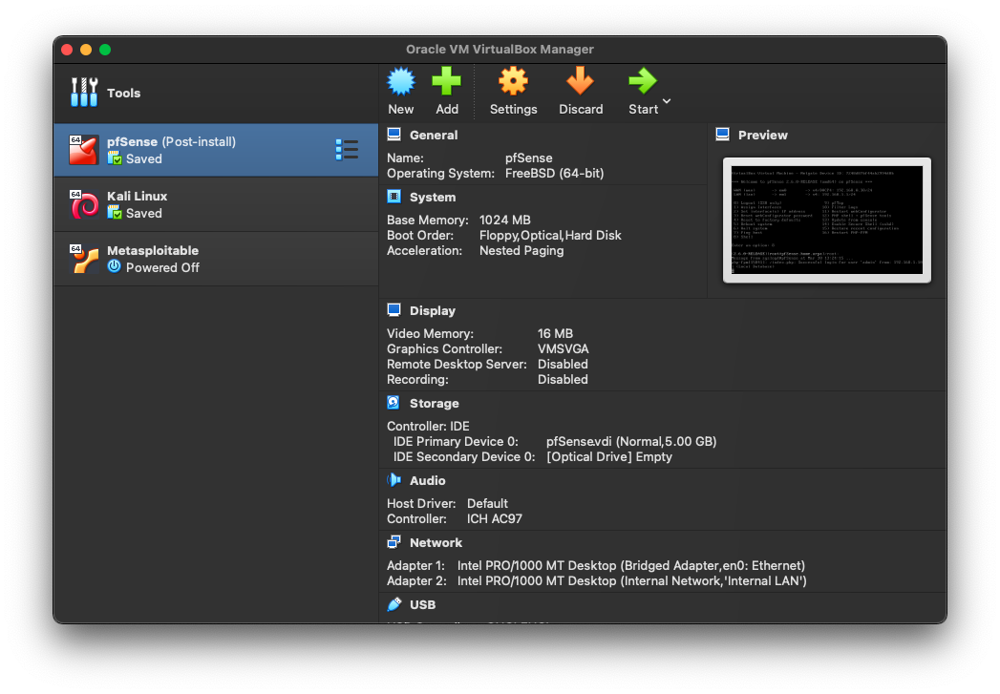

# Ethical Hacking

Practice by doing tasks from Ethical Hacking Book by Daniel G. Graham 2022

### Reading progress:
- [x] I Part
- [ ] II Part
- [ ] III Part
- [ ] IV Part
- [ ] V Part

### Links
* [link](https://www.netresec.com/)
* [link](https://www.iana.org/assignments/service-names-port-numbers/service-names-port-numbers.xhtml)
* [link](https://nvd.nist.gov/)
